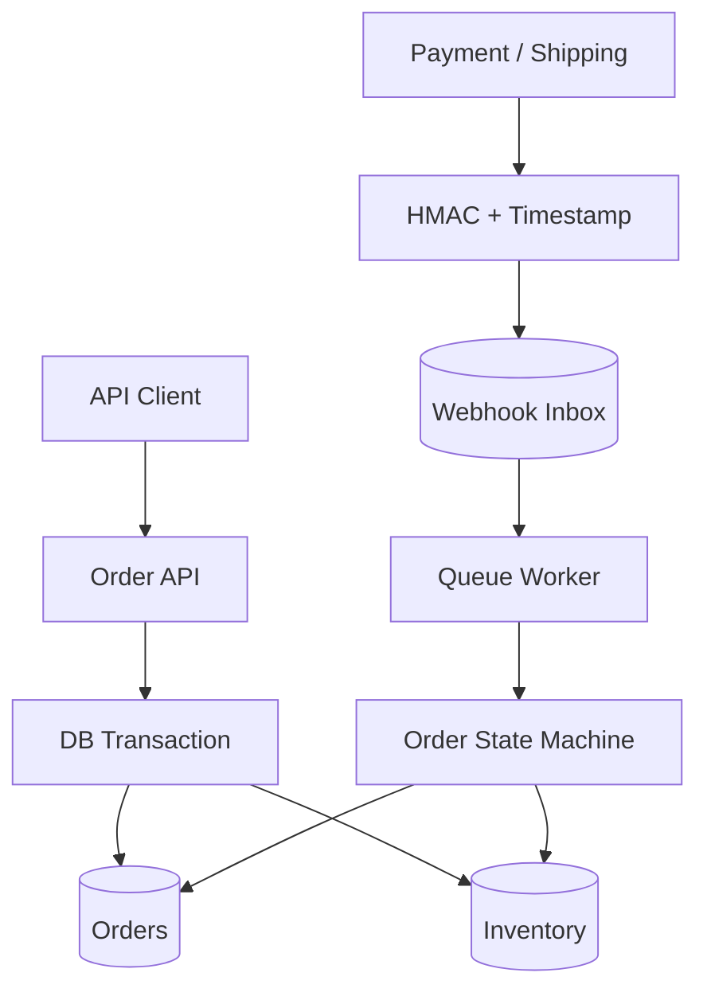

# Laravel Commerce Platform

一個為後端工程師面試作品設計的 Laravel 12 電商核心服務，聚焦在最容易出現競態與資料不一致的三條流程：**訂單、庫存、金流／物流 Webhook**。

> 金額一律使用最小貨幣單位的整數（TWD 範例為元），不使用浮點數。

## 作品亮點

- 下單、庫存保留與訂單明細快照置於同一個 DB transaction。
- `SELECT ... FOR UPDATE` 鎖定庫存列，並依 `product_id` 排序降低 deadlock 機率。
- 保留庫存（reserved）與實際庫存（on_hand）分離；付款成功才 commit，逾時／取消則 release。
- 訂單狀態機禁止跳步或從終態回復，業務規則集中且可單元測試。
- Webhook 使用 HMAC-SHA256、timestamp replay window、event ID unique constraint。
- Webhook 先快速回傳 `202`，再交給 queue；具 exponential backoff、處理紀錄與錯誤追蹤。
- 付款金額與幣別會再次對帳，原始 payload 加密儲存。
- SQLite 可快速展示，也保留 MySQL 設定；附 Docker、CI、測試與 curl 範例。

## 架構



Webhook inbox 讓「接收外部事件」與「執行內部業務」解耦；供應商重送相同 event ID 時，只會建立一筆事件並排入一次工作。

## 快速開始

需求：PHP 8.3+、Composer 2。

```bash
composer install
cp .env.example .env
touch database/database.sqlite
php artisan key:generate
php artisan migrate --seed
php artisan serve
```

另開一個終端執行 queue worker：

```bash
php artisan queue:work --tries=5
```

或使用 Docker：

```bash
docker compose up --build
```

## 展示流程

先從 `products` API 未提供的情況下，使用 seeder 產生的第一個商品 ID（通常為 `1`）建立訂單：

```bash
curl -X POST http://localhost:8000/api/v1/orders \
  -H 'Content-Type: application/json' \
  -d '{
    "customer_email":"buyer@example.com",
    "shipping_address":{"recipient":"王小明","phone":"0912345678","address":"台北市信義區"},
    "items":[{"product_id":1,"quantity":2}]
  }'
```

Webhook 的簽章字串是 `{timestamp}.{raw_body}`。完整 request/response 與產生簽章方式見 [API 文件](docs/API.md)。

## 一致性設計

| 情境 | 保護方式 |
| --- | --- |
| 兩人同時買最後一件 | transaction + inventory row lock + available 計算 |
| 付款 Webhook 重送 | `(provider, event_id)` 唯一鍵 + handler 再次檢查付款狀態 |
| Webhook 被竄改／重播 | HMAC、常數時間比較、5 分鐘 timestamp window |
| 付款金額錯誤 | 與訂單 total / currency 對帳後才扣庫存 |
| Worker 暫時失敗 | 最多五次重試、退避、failed_jobs 與 last_error |
| 未付款訂單占用庫存 | 每分鐘取消過期訂單並 release reserved |
| 商品改名／改價 | order_items 保留成交當下 SKU、名稱、單價快照 |

更完整的取捨、失敗模式與正式環境改進項目見 [架構決策](docs/ARCHITECTURE.md)。

## 測試與品質

```bash
composer lint
composer test
```

目前測試涵蓋狀態轉換、Webhook 簽章、庫存保留／不足，以及 Webhook 冪等接收。GitHub Actions 會在 push 與 pull request 執行 Pint 與 PHPUnit。

## License

MIT
