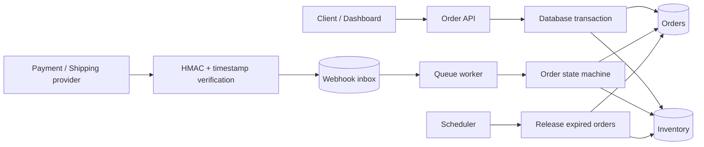
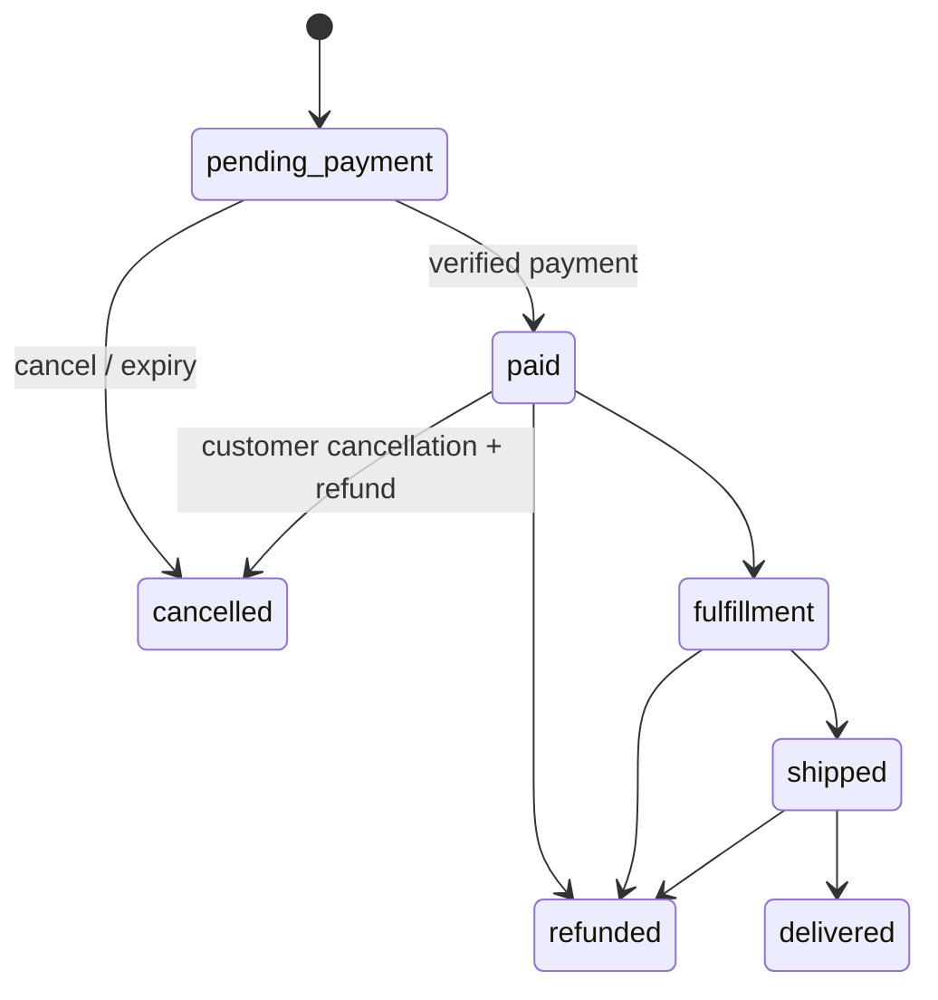

# Laravel Commerce Platform

 Laravel 12 電商訂單後端。專案聚焦在高併發下的訂單與庫存一致性、可信任的金流／物流 Webhook，以及可觀測、可重試的非同步處理。

專案同時提供繁體中文消費者購物前台與 Engineering Dashboard。Reviewer 可以完成商品瀏覽、購物車與結帳，再切換至工程儀表板觀察 `on_hand`、`reserved`、訂單狀態與 Webhook inbox 的變化。

> 金額皆以最小貨幣單位整數儲存。例如 `79000` 代表 TWD 790.00，避免浮點數誤差。

## What this demonstrates

- 完整購物流程：商品瀏覽、獨立購物車、結帳付款與訂單完成
- 顧客訂單中心：繁體中文進度、各狀態異動時間、物流追蹤與接單前取消／退款
- 後台履約：管理員依序執行接單備貨、出貨與送達
- 已付款取消會在資料庫交易內同步退款並回補實際庫存

- 明確的訂單狀態機與非法轉移防護
- Session 登入與 `customer`／`admin` 角色授權
- 自建模擬付款 API、結帳付款頁與簽章 Webhook 流程
- 庫存保留、付款扣除、取消／逾期釋放
- `DB::transaction()`、`SELECT ... FOR UPDATE`、固定鎖定順序
- transaction deadlock retry（最多 3 次）
- 金流／物流 Webhook inbox pattern
- HMAC-SHA256、timestamp replay window、constant-time comparison
- `(provider, event_id)` 唯一約束與 payload hash 衝突偵測
- Queue retry、exponential backoff、attempts 與 last error
- 付款金額與幣別核對
- Scheduler 自動取消逾期未付款訂單
- CI、feature tests 與 unit tests

## Architecture



### Order lifecycle



### Inventory invariants

```text
available = on_hand - reserved

Create order:    reserved += quantity
Payment success: reserved -= quantity; on_hand -= quantity
Unpaid cancel / expiry: reserved -= quantity
Paid cancellation:      on_hand += quantity; payment = refunded
```

所有多商品操作依 `product_id` 排序後取得 row lock，降低不同交易以相反順序鎖定資料造成 deadlock 的機率。

## Quick start

需求：PHP 8.3+、Composer 2、對應 PHP extensions。

```bash
composer install
cp .env.example .env
php artisan key:generate
php artisan migrate --seed
php artisan serve
```

SQLite 資料庫不存在時，Laravel 會詢問是否建立 `database/database.sqlite`，回答 `yes` 即可。

開啟：

- 購物網站: <http://127.0.0.1:8000>
- 會員登入: <http://127.0.0.1:8000/login>
- 顧客訂單: <http://127.0.0.1:8000/account>
- 工程 Dashboard: <http://127.0.0.1:8000/engineering>
- Health check: <http://127.0.0.1:8000/up>
- API reference: <http://127.0.0.1:8000/docs/API.md>

另開兩個 terminal 執行 worker 與 scheduler：

```bash
php artisan queue:work --tries=5
php artisan schedule:work
```

### 展示登入帳號

執行 `php artisan migrate --seed` 後會建立：

| 角色 | 電子郵件 | 密碼 | 權限 |
| --- | --- | --- | --- |
| 顧客 | `customer@example.com` | `password` | 結帳、查看自己的訂單 |
| 管理員 | `admin@example.com` | `password` | 進入工程 Dashboard |

以上帳號只供本機與作品展示使用，正式環境應改用安全密碼及完整帳號生命週期。

### 模擬付款環境設定

環境相關的 Provider 與 URL 放在 `.env`；實際 HTTP route 仍由 Laravel `routes` 定義：

```env
PAYMENT_PROVIDER=simulator
PAYMENT_API_BASE_URL="${APP_URL}/api/v1/simulator"
PAYMENT_WEBHOOK_URL="${APP_URL}/api/v1/webhooks/payments/simulator"
PAYMENT_WEBHOOK_SECRET=local-payment-secret
```

模擬付款 API：

```bash
curl -X POST http://127.0.0.1:8000/api/v1/simulator/payments \
  -H "Content-Type: application/json" \
  -d '{
    "order_number": "ORD-20260804-XXXXXXXX",
    "method": "credit_card",
    "outcome": "success"
  }'
```

可用付款方式：`credit_card`、`bank_transfer`、`mobile_payment`。模擬 API 僅在 `local` 與 `testing` 環境開放。

也可以使用 Docker：

```bash
docker compose up --build
```

## Demo walkthrough

1. 使用顧客帳號登入，在商店將商品加入獨立購物車頁。
2. 前往結帳頁，填寫收件資料並選擇付款方式。
3. 送出後由模擬金流走 HMAC Webhook 流程，訂單轉為 `paid`。
4. 在 `/account` 查看每個訂單狀態的異動時間。
5. 使用管理員帳號進入 `/engineering`，依序操作接單、出貨與送達。
6. 回到顧客訂單中心，確認進度、異動時間及物流追蹤碼同步更新。
7. 另可透過 API 重送相同 event，驗證 inbox 冪等與 payload 衝突防護。

## API examples

### Create an order

Seeder 產生的第一個商品 ID 通常為 `1`。

```bash
curl -X POST http://127.0.0.1:8000/api/v1/orders \
  -H "Content-Type: application/json" \
  -d '{
    "customer_email": "buyer@example.com",
    "shipping_address": {
      "recipient": "Demo User",
      "phone": "0912345678",
      "address": "Taipei, Taiwan"
    },
    "items": [{"product_id": 1, "quantity": 2}]
  }'
```

### List and inspect orders

```bash
curl http://127.0.0.1:8000/api/v1/orders
curl http://127.0.0.1:8000/api/v1/orders/1
```

Webhook 的簽章內容為：

```text
HMAC-SHA256(secret, "{timestamp}.{raw_request_body}")
```

完整 payload 與端點請見 [`docs/API.md`](docs/API.md)。

## Consistency decisions

| Risk | Protection |
| --- | --- |
| Two buyers reserve the last item | transaction + inventory row lock + available check |
| Multi-item transactions deadlock | stable `product_id` lock order + transaction retry |
| Provider sends the same event twice | unique `(provider, event_id)` + idempotent handler |
| Event ID is reused with altered content | stored SHA-256 payload hash + `409 Conflict` |
| Forged or replayed Webhook | HMAC verification + timestamp tolerance |
| Payment has wrong amount or currency | compare against immutable order snapshot before mutation |
| Worker crashes temporarily | database queue + backoff + failed jobs + inbox error state |
| Customer never pays | scheduled cancellation + reserved inventory release |
| Product data changes after checkout | SKU, name and unit price snapshot in `order_items` |

## SQLite and MySQL

SQLite is the default because it gives reviewers a near-zero-configuration demo and fast in-memory tests. SQLite does **not** reproduce MySQL row-lock and deadlock behavior exactly.

Production-style concurrency validation should use MySQL 8. The application code deliberately uses `lockForUpdate()` and transaction retry so the same domain flow can run with MySQL's locking semantics. This distinction is documented rather than claiming SQLite proves behavior it does not provide.

## Tests and quality

```bash
composer lint
composer test
```

The suite covers:

- state transition rules
- price snapshot and stock reservation
- insufficient inventory rollback
- payment commit and amount mismatch rollback
- cancellation and expiry release
- valid, invalid and stale Webhook signatures
- duplicate Webhook dispatch
- reused event ID with conflicting payload

GitHub Actions runs Pint and PHPUnit on every push and pull request.

## Before publishing

Never commit `.env`, local SQLite data, production credentials or real Webhook secrets. After publishing, add a GitHub Actions badge with the final repository URL.

## License

MIT
