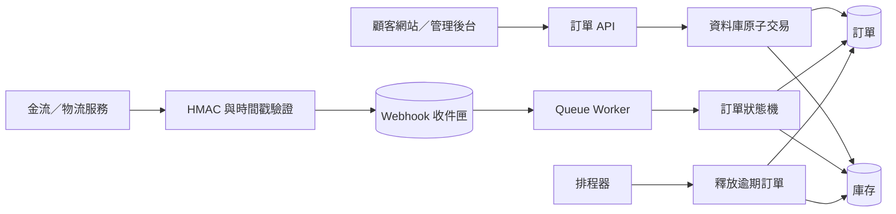
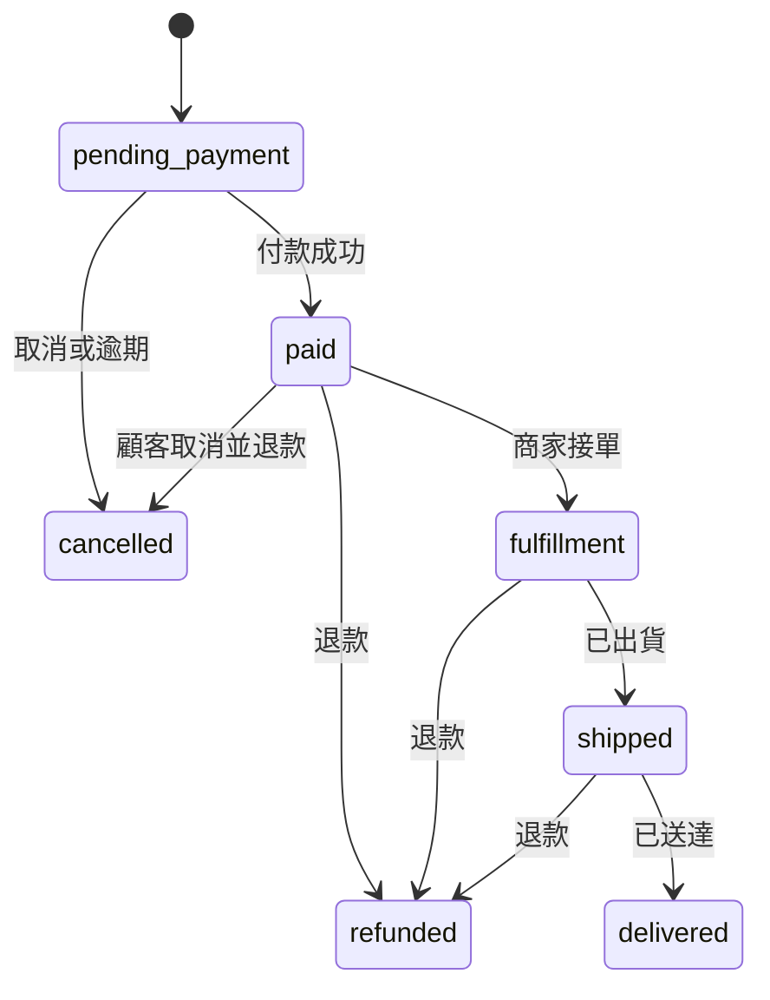

# Laravel 電商交易平台

這是一個使用 Laravel 12 建立的電商作品集專案，包含顧客購物流程、商店管理後台、訂單狀態機、庫存一致性、模擬付款以及 Webhook 安全處理。

專案不只展示商品與結帳畫面，也著重實務電商系統常見的問題：避免超賣、重複扣款、Webhook 重複處理、付款資料核對，以及未付款訂單逾時釋放庫存。

> 金額以最小貨幣單位儲存。例如 `79000` 代表新臺幣 790 元，可避免浮點數計算誤差。

## 功能特色

- 繁體中文顧客購物網站
- 商品瀏覽、購物車、結帳與模擬付款
- 顧客／管理員角色登入與權限隔離
- 顧客訂單查詢、狀態時間軸與取消訂單
- 商店管理後台、訂單搜尋、篩選與分頁
- 接單、出貨、送達與取消等訂單流程
- 訂單狀態機與合法狀態轉換限制
- 庫存保留、付款扣除、取消與逾時回補
- 資料庫交易、資料列鎖定與死結重試
- HMAC-SHA256 簽章與時間戳防重播
- Webhook 收件匣、冪等處理與 Queue 重試
- 付款金額及幣別核對
- 排程自動取消逾期訂單
- Feature Test、Unit Test 與 GitHub Actions

## 系統架構



### 訂單生命週期



前端會將 `pending_payment`、`paid`、`fulfillment` 等程式代號轉換為繁體中文，資料庫與 API 則保留穩定代號，避免顯示文字異動影響系統整合。

### 庫存計算規則

```text
可銷售庫存 = 實際庫存 on_hand - 保留庫存 reserved

建立訂單：           reserved += quantity
付款成功：           reserved -= quantity；on_hand -= quantity
未付款取消或逾期：   reserved -= quantity
已付款訂單取消：     on_hand += quantity；payment = refunded
```

多商品訂單會依照 `product_id` 的固定順序鎖定庫存資料列，降低不同交易以相反順序取得鎖定而產生死結的機率。

## 使用版本

- PHP 8.3 以上
- Laravel 12
- Composer 2
- Node.js 20 以上
- Vite 6
- Sass
- SQLite（預設展示環境）
- MySQL 8（正式環境建議）

## 快速開始

### Windows PowerShell

```powershell
composer install
npm install
Copy-Item .env.example .env
php artisan key:generate
php artisan migrate --seed
npm run build
php artisan serve
```

如果電腦同時安裝多個 PHP 版本，請確認：

```powershell
php -v
where.exe php
```

本專案需要 PHP 8.3 以上。使用 WampServer 時也可以指定完整路徑：

```powershell
& 'D:\wamp64\bin\php\php8.3.33\php.exe' artisan migrate --seed
& 'D:\wamp64\bin\php\php8.3.33\php.exe' artisan serve
```

### macOS／Linux

```bash
composer install
npm install
cp .env.example .env
php artisan key:generate
php artisan migrate --seed
npm run build
php artisan serve
```

SQLite 資料庫不存在時，Laravel 會詢問是否建立 `database/database.sqlite`，輸入 `yes` 即可。

啟動後可開啟：

| 頁面 | 網址 |
| --- | --- |
| 商店首頁 | </> |
| 登入頁面 | </login> |
| 顧客帳戶 | </account> |
| 商店管理後台 | </engineering> |
| 健康檢查 | </up> |
| API 文件 | </docs/API.md> |

## 前端資源

開發期間啟動 Vite：

```bash
npm run dev
```

建立正式環境前端檔案：

```bash
npm run build
```

Vite 會將編譯結果輸出至 `public/build`。該目錄屬於建置產物，因此不提交到 Git。

## 測試帳號

執行 `php artisan migrate --seed` 後可使用：

| 角色 | 電子郵件 | 密碼 | 可使用功能 |
| --- | --- | --- | --- |
| 顧客 | `customer@example.com` | `password` | 購物、結帳、付款、查詢與取消訂單 |
| 管理員 | `admin@example.com` | `password` | 查看後台、接單、出貨與完成訂單 |

測試帳號只適合本機與展示環境，正式上線前必須移除或更換。

## 模擬付款設定

付款服務名稱與 API 網址放在 `.env`，避免將不同環境的主機名稱寫死在程式碼內：

```env
PAYMENT_PROVIDER=simulator
PAYMENT_API_BASE_URL="${APP_URL}/api/v1/simulator"
PAYMENT_WEBHOOK_URL="${APP_URL}/api/v1/webhooks/payments/simulator"
PAYMENT_WEBHOOK_SECRET=local-payment-secret
```

模擬付款 API：

```bash
curl -X POST http://127.0.0.1:8000/api/v1/simulator/payments \
  -H "Content-Type: application/json" \
  -d '{
    "order_number": "ORD-20260804-XXXXXXXX",
    "method": "credit_card",
    "outcome": "success"
  }'
```

支援的模擬付款方式包括：

- `credit_card`：信用卡
- `bank_transfer`：銀行轉帳
- `mobile_payment`：行動支付

模擬 API 僅應在 `local` 或 `testing` 環境開啟。

## API 使用範例

### 建立訂單

Seeder 建立的第一項商品 ID 通常為 `1`：

```bash
curl -X POST http://127.0.0.1:8000/api/v1/orders \
  -H "Content-Type: application/json" \
  -d '{
    "customer_email": "buyer@example.com",
    "shipping_address": {
      "recipient": "測試顧客",
      "phone": "0912345678",
      "address": "臺北市信義區測試路 1 號"
    },
    "items": [{"product_id": 1, "quantity": 2}]
  }'
```

### 查詢訂單

```bash
curl http://127.0.0.1:8000/api/v1/orders
curl http://127.0.0.1:8000/api/v1/orders/1
```

Webhook 簽章內容：

```text
HMAC-SHA256(secret, "{timestamp}.{raw_request_body}")
```

更完整的請求格式請參考 [`docs/API.md`](docs/API.md)。

## 交易一致性設計

| 風險 | 保護措施 |
| --- | --- |
| 兩位顧客同時購買最後一件商品 | 資料庫交易、庫存資料列鎖定與可銷售數量檢查 |
| 多商品交易發生死結 | 固定 `product_id` 鎖定順序與交易重試 |
| 金流重複傳送相同事件 | `(provider, event_id)` 唯一鍵與冪等處理 |
| 相同事件 ID 被替換成不同內容 | 儲存 SHA-256 payload hash，衝突時回傳 `409` |
| 偽造或重播 Webhook | HMAC 簽章驗證與時間戳容許範圍 |
| 付款金額或幣別不正確 | 修改訂單前比對不可變更的訂單金額快照 |
| Queue Worker 暫時失敗 | 資料庫 Queue、退避重試、失敗工作與 inbox 錯誤狀態 |
| 顧客一直沒有付款 | 排程取消訂單並釋放保留庫存 |
| 結帳後商品資料被修改 | 在 `order_items` 保存 SKU、名稱與單價快照 |

### 什麼是原子交易

原子交易代表一組資料庫操作必須「全部成功」或「全部失敗」。例如付款成功時，需要同時更新付款紀錄、訂單狀態與庫存；只要其中一步發生錯誤，所有變更都會回復，避免出現已付款但訂單未更新，或扣款成功卻沒有扣除庫存等不一致狀況。

Laravel 中使用 `DB::transaction()` 包住這些操作。

## SQLite 與 MySQL 的差異

預設使用 SQLite，讓面試官不需要額外安裝資料庫即可快速執行專案，也適合快速測試。

SQLite 無法完全重現 MySQL 的資料列鎖定與死結行為。正式環境或併發測試建議使用 MySQL 8；應用程式已使用 `lockForUpdate()` 與交易重試，使相同商業流程可套用 MySQL 的鎖定機制。

## Queue 與排程器

開發時可分別開啟兩個終端機：

```bash
php artisan queue:work --tries=5
```

```bash
php artisan schedule:work
```

單機展示環境也可以設定：

```env
QUEUE_CONNECTION=sync
```

## Docker 執行

```bash
docker compose up --build
```

啟動前請確認 Docker Desktop 的 Linux Engine 已正常運作。

## 自動化測試與程式品質

```bash
composer lint
composer test
```

測試涵蓋：

- 登入、角色權限與受保護頁面
- 訂單狀態轉換規則
- 商品價格快照與庫存保留
- 庫存不足時完整回復交易
- 付款成功與金額不符時的處理
- 訂單取消、退款與逾期釋放庫存
- 有效、無效及過期的 Webhook 簽章
- 重複 Webhook 的冪等處理
- 相同事件 ID 搭配不同內容的衝突處理
- 完整顧客購買與管理員出貨流程

GitHub Actions 會在每次 Push 與 Pull Request 時執行 Laravel Pint 與 PHPUnit。

## 展示專案

環境設定：

```env
APP_ENV=production
APP_DEBUG=false
APP_URL=https://你的展示網址
QUEUE_CONNECTION=sync
SESSION_DRIVER=database
DB_CONNECTION=sqlite
```

若暫時沒有公開主機，建議在 `docs/screenshots` 放置商店首頁、購物車、結帳、顧客訂單與管理後台截圖，讓瀏覽 GitHub 的人可以快速理解網站內容。

## 授權

本專案採用 MIT License。
