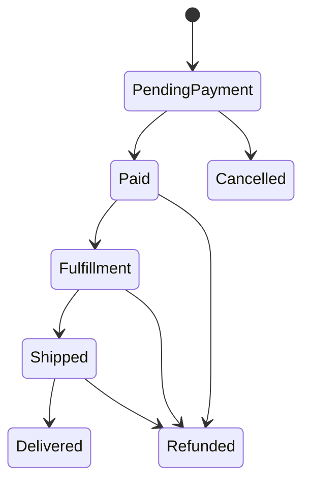

# Architecture Decisions

## Order and inventory transaction

An order first reserves stock: `available = on_hand - reserved`. Inventory rows are locked in ascending product ID order before checking and incrementing reservations. Order creation and reservation share one transaction, so either both persist or neither does.

Payment success obtains the order lock, validates amount/currency, changes `on_hand` and `reserved`, and transitions the order in one transaction. Cancellation obtains the same order lock and releases reservations. This serializes the race between payment and expiration without a distributed lock.

SQLite is convenient for demonstration, but concurrency behavior should be validated on the production database (typically MySQL/PostgreSQL).

## Webhook inbox and idempotency

The HTTP layer verifies authenticity, validates the envelope, and inserts a webhook inbox row. A unique `(provider, event_id)` index is the final concurrency-safe idempotency guard. Only a newly inserted event is dispatched.

The worker is deliberately idempotent as a second defense: it exits for a processed inbox item, payment uniqueness is enforced by `(provider, provider_payment_id)`, and a succeeded payment is not applied twice.

HTTP `202` means accepted, not completed. A production service should expose metrics for pending age, failure count, retries, queue depth, and provider latency.

## State machines

Unsupported transitions throw instead of silently updating status. For a larger domain, each transition would be a command with authorization, audit metadata, and domain events.

## Production evolution

1. Define provider adapters that normalize vendor-specific signatures and payloads into internal events.
2. Publish downstream events with a transactional outbox, avoiding the DB-commit/message-publish gap.
3. Add refund, chargeback, partial capture, split shipment, returns, and reconciliation jobs.
4. Use MySQL/PostgreSQL integration tests with parallel requests to exercise locking and deadlocks.
5. Add authentication/authorization, audit logs, PII retention rules, secret rotation, observability, and alerting.
6. Add an admin UI only after the transactional boundary and operational workflows are stable.
